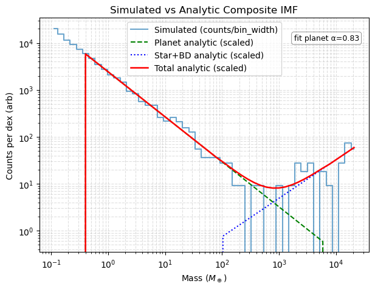
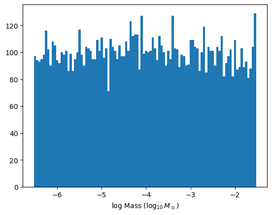

# Planet Array Generator Scripts

This repository contains two Python scripts for generating arrays of simulated planet properties for microlensing or exoplanet studies. Each script draws planet masses from a different distribution:

- `SUMI2023_draw_planet_arrays.py`: Draws planet masses from the Sumi 2023 power-law mass function.
- `uniform_draw_planet_arrays copy.py`: Draws planet masses from a log-uniform distribution.

## Requirements

- Python 3.x
- NumPy

## Input

Both scripts require a source file (default: `gulls_surot2d_H2023.sources`) containing field numbers in the first column. Each field will have planet arrays generated for it.

## Output

- Output files are saved in the `planets/<run_name>/` directory (e.g., `planets/test_uniform_draw/`).
- Each file is named as `<run_name>.planets.<field_number>.<file_index>`.
- Each file contains columns: `mass (M_Sun), a (au), inc (deg), p (deg)`.

## Usage

### 1. Sumi 2023 Mass Function

This script draws planet masses from the Sumi 2023 power-law mass function (α = 0.96, 0.33–6660 Earth masses).

```bash
python SUMI2023_draw_planet_arrays.py
```

[](SUMI_MF_VERIFICATION.png)

### 2. Log-Uniform Mass Function

This script draws planet masses from a log-uniform distribution (0.1–10,000 Earth masses).

```bash
python uniform_draw_planet_arrays.py
```

[](LOG_UNIFORM_MF_VERIFICATION.png)


## Customization

- To change the number of planets per file, edit the `nl` variable.
- To change the number of files per field, edit the `nf` variable.
- To change the input source file, edit the `sources_file` variable.
- To change the output directory or run name, edit the `data_dir` and `rundes` variables.

## Notes

- If an output file already exists, it will be skipped.
- The scripts use multiprocessing to speed up generation across fields.

## Example Output

Each output file contains a table with columns:

```
mass (M_Sun), a (au), inc (deg), p (deg)
```

where:
- `mass (M_Sun)`: Planet mass in solar masses
- `a (au)`: Semi-major axis in astronomical units
- `inc (deg)`: Inclination in degrees
- `p (deg)`: Argument of periapsis in degrees

---

For questions or issues, please contact the script author.
