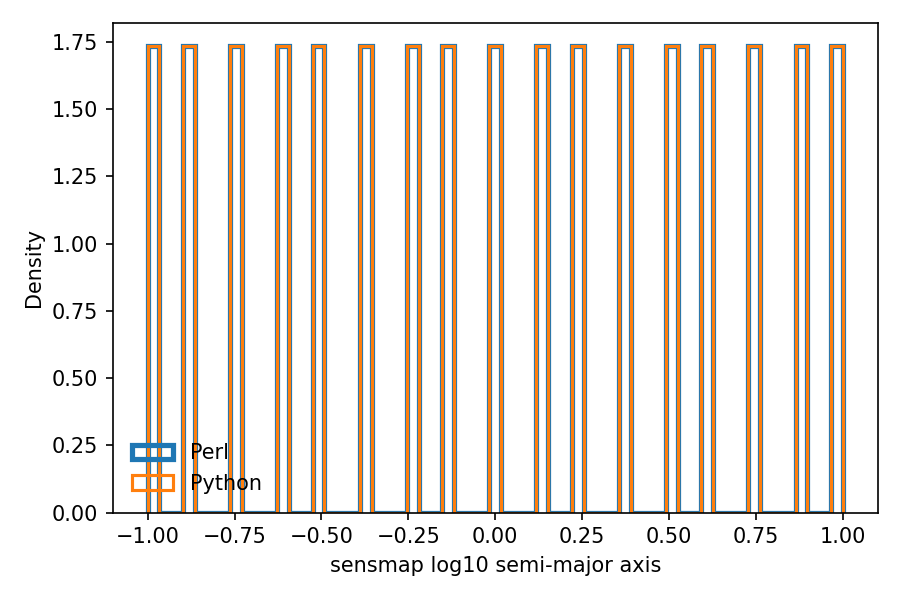

# Planet Array Generator Scripts

This repository provides sampling scripts for generating synthetic planet (and low–mass star / brown dwarf) properties useful for microlensing / population studies. It now includes both stochastic samplers and a sensitivity-map grid generator ported from the legacy Perl workflow.

Distributions implemented:

* `sumi2023_draw_planet_arrays.py` – **Composite Sumi-style mass function**: a *sum* of two independent power-law segments in base-10 logarithmic mass space:
	- Planet (free-floating / wide orbit) component:
		\( \frac{dN}{d\log_{10} M} = Z_{\rm planet} \,( M / M_{\rm pivot,planet} )^{-\alpha_4} \)
		with published parameters \(\alpha_4 = 0.96\), \(Z_{\rm planet}=2.18\, \mathrm{dex^{-1}\,star^{-1}}\), pivot \(M_{\rm pivot,planet}=8\,M_\oplus\), validity approximately 0.33–6660 \(M_\oplus\) (1e-6–0.02 M\(_\odot\)). Integrates to ~21 planets per star over that range.
	- Rising star + brown dwarf (BD) low-mass tail:
		\( \frac{dN}{d\log_{10} M} = A_{\rm BD} \,( M / M_{\rm pivot,BD} )^{-\alpha_3} \)
		with \(\alpha_3 = -0.82\) (negative ⇒ rises with increasing mass), pivot \(M_{\rm pivot,BD}=38\,M_\oplus\). The amplitude \(A_{\rm BD}\) is solved internally from a target number of brown dwarfs per star in a chosen interval (default: 0.2 objects in 0.012–0.08 M\(_\odot\)). Validity adopted: 3×10⁻⁴–0.8 M\(_\odot\) (~100–2.6×10⁵ M\(_\oplus\)).
	- The total differential frequency is the *sum* of the two segments wherever they overlap. There is no rejection; sampling uses analytic inverse CDFs and mixture weights from exact integrals.
	- Output includes a component label column (`comp`): 0 = planet segment, 1 = star/BD segment.

* `uniform_draw_planet_arrays.py` – **Log-uniform baseline**: masses drawn log-uniform between 0.1–10,000 M\(_\oplus\); semi-major axes log-uniform (0.3–30 au); inclinations isotropic; orbital phase uniform.

* `sensmap_draw_planet_arrays.py` – **Sensitivity-map grid**: reproduces the deterministic mass/semi-major axis grid from `sensmap.pl` (13 × 17 points, repeated five times) while sampling inclination and orbital phase randomly. Fields are discovered from the same sources file, enabling parity with the Perl pipeline. Because the grid is deterministic, every catalogue shares the same 13 discrete log-mass and 17 log–semi-major-axis bins; the only stochastic components are the angular draws.

* `suzuki_draw_planet_arrays.py` - **THIS SCRIPT IS UNTESTED. PROCEED WITH EXTREME CAUTION>**

## Requirements

* Python 3.11+ (tested)
* NumPy

Optional (for exploration / plotting): matplotlib, pandas (used in the notebook).

## Input

All scripts read a source file (default: `gulls_surot2d_H2023.sources`) whose first whitespace–delimited column lists integer field identifiers. For each field, `nf` files of `nl` sampled objects are produced (parallelized across CPU cores). The sensitivity-map scripts instead iterate over `n_subruns` and reuse the fixed grid for every field.

## Output

Files are written under `planets/<run_name>/` as:

```
<run_name>.planets.<field_number>.<file_index>
```

Columns:

* `mass (M_Sun)` – Mass in solar masses (sampled internally in Earth masses).
* `a (au)` – Semi–major axis (au, log–uniform between configured bounds).
* `inc (deg)` – Signed inclination (deg) from an isotropic distribution.
* `p (deg)` – Orbital phase (deg) uniform in [0, 360).
* `comp (0=planet,1=starbd)` – (Only in SUMI composite script) segment identifier.

The sensitivity-map (sensmap) outputs omit headers by default to match the Perl format and always use space-delimited columns.

## Usage

### 1. Composite Sumi-style Mass Function

Generates a mixture of the declining planetary power law and the rising star+BD segment; mixture weights are exact integrals over the requested mass interval. Supports deterministic runs via `FIXED_BASE_SEED`.

```bash
python sumi2023_draw_planet_arrays.py
```

[](SUMI_MF_VERIFICATION.png)

### 2. Log-Uniform Mass Function

Baseline sampler with purely log-uniform mass distribution (0.1–10,000 M\(_\oplus\)).

```bash
python uniform_draw_planet_arrays.py
```

[](LOG_UNIFORM_MF_VERIFICATION.png)

### 3. Sensitivity-Map Grid Generator

Generates deterministic mass/semi-major-axis grids with randomized inclination and phase, mirroring the legacy `sensmap.pl` output.

```bash
python sensmap_draw_planet_arrays.py
```

To run the original Perl implementation (now reading the same sources file and allowing overrides), use:

```bash
perl sensmap.pl [sources_file] [run_name] [n_subruns] [n_repeats]
```

Setting the environment variable `SENSMAP_SEED` fixes the Perl RNG for reproducibility in tests.

[](tests/artifacts/distribution_alignment/sensmap_log10_mass__earth_units__comparison.png)

Above: Perl (thick blue outline) and Python (orange) mass distributions overlap perfectly because both emit the same 13 log-mass bins; the discrete spikes make the traces appear as a single line.

[](tests/artifacts/distribution_alignment/sensmap_log10_semi_major_axis_comparison.png)

Semi-major axes exhibit the same behaviour across 17 fixed bins. These visual checks complement the automated equality assertions in the regression tests.


## Testing

Run the regression test to confirm the Python and Perl samplers draw from the same distributions (covering both the uniform sampler and the sensmap grid):

```bash
conda env create -f requirements-test.yml
conda activate planets-test
pytest tests/test_distribution_alignment.py
```

The test suite spawns the Perl scripts, so make sure `perl` is on your `PATH`.

## Customization

Key parameters (edit near top of each script):

* `nl` – number of objects per output file.
* `nf` – number of files per field.
* `rundes` – run descriptor used in output directory & filenames.
* `sources_file` – path to field list.
* `file_ext` – set to `.npy` for NumPy binary output; empty for CSV-like text.
* `overwrite_existing` – if False existing files are left intact.
* `FIXED_BASE_SEED` – set an integer for reproducible deterministic sampling across processes.
* `delineator` / `header` – control separator and header emission for text outputs (can mimic the Perl format with `' '` + `False`).

Sensmap-specific parameters:

* `n_subruns` – number of subrun catalogues per field.
* `n_repeats_per_grid_point` – how many times the 13×17 grid is repeated.
* `FIXED_BASE_SEED` – same deterministic seeding support as the other scripts.

Since the mass/semi-major-axis grid is fixed, parity checks focus on angular randomness: both Perl and Python catalogues share identical mass/SMA columns, while inclination and orbital phase are validated statistically (via Kolmogorov–Smirnov tests and the overlay plots above). The histograms highlight the discrete bin structure so reviewers know the aligned traces are expected.

Composite-only parameters (defaults derived from literature):

* `Z_PLANET`, `ALPHA_PLANET` (α4), `PIVOT_PLANET`.
* `A_BD` (solved amplitude), `ALPHA3`, `PIVOT_BD`.
* Global mass truncation (`mmin`, `mmax`) and semi–major axis log bounds (`amin`, `amax`).

## Notes

* Multiprocessing: a pool sized by `mp.cpu_count()` is used; each task derives a unique RNG seed when `FIXED_BASE_SEED` is set.
* Mass sampling in the composite script is analytic (no rejection), ensuring efficiency even for large draws.
* Component labels enable downstream filtering (e.g., isolate planetary segment only).
* The uniform script omits the label column by design.

## Example Output

Example composite output header (text mode):

```
# mass (M_Sun), a (au), inc (deg), p (deg), comp (0=planet,1=starbd)
```

Example uniform output header:

```
# mass (M_Sun), a (au), inc (deg), p (deg)
```

---

For questions or issues, please contact the script author.
